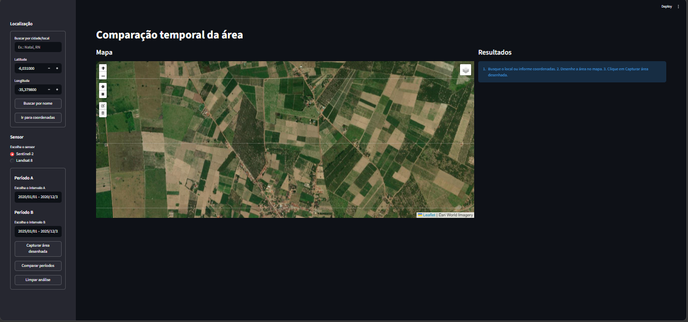
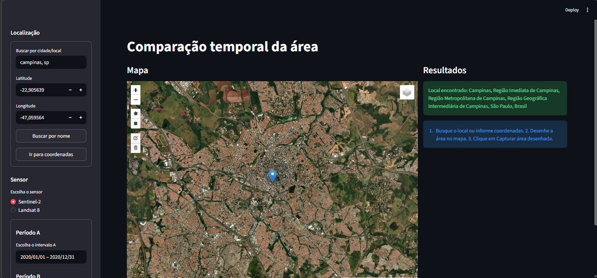
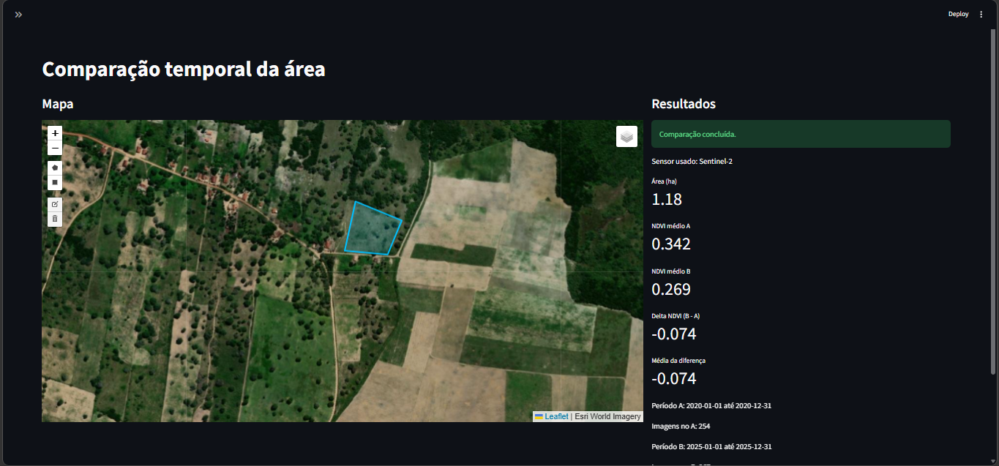
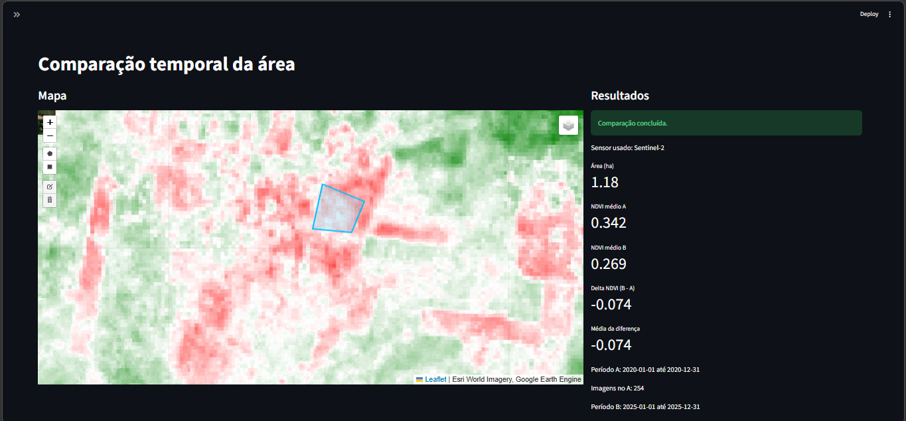

# Comparação Temporal de Áreas com NDVI

Aplicação em Python para análise geoespacial de áreas agrícolas usando imagens de satélite, Google Earth Engine, Folium e Streamlit.

O sistema permite buscar um local por nome ou por coordenadas, desenhar o perímetro da área no mapa, escolher o sensor e comparar o NDVI entre dois períodos diferentes.

---

## Demonstração

### Tela inicial


### Busca por local


### Área desenhada no mapa


### Comparação temporal de NDVI



---

## Sobre o projeto

Este projeto foi desenvolvido para analisar a evolução de uma área ao longo do tempo com base em imagens de satélite.

A aplicação permite:

- Buscar a área de interesse por nome da cidade/local.
- Centralizar o mapa por latitude e longitude.
- Desenhar polígonos ou retângulos sobre a área de análise.
- Calcular a área do perímetro selecionado em hectares.
- Comparar dois períodos diferentes com base no NDVI.
- Visualizar camadas RGB, NDVI do período A, NDVI do período B e a diferença entre os dois períodos.
- Escolher entre Sentinel-2 e Landsat 8 como fonte de dados.

---

## Tecnologias utilizadas

- Python
- Streamlit
- Google Earth Engine
- Folium
- streamlit-folium
- Nominatim / OpenStreetMap
- Requests

---

## Como o sistema funciona

O fluxo da aplicação é simples:

1. O usuário informa um local por nome ou por coordenadas.
2. O mapa é centralizado na região escolhida.
3. O usuário desenha o perímetro da área no mapa.
4. A geometria desenhada é capturada pela aplicação.
5. O usuário seleciona o sensor e define dois períodos de análise.
6. O sistema consulta as imagens no Google Earth Engine.
7. O NDVI é calculado para cada período.
8. A aplicação calcula a diferença entre os períodos e mostra os resultados no mapa e no painel lateral.

---

## Estrutura do projeto

```bash
.
├── app.py
├── geoprocessamento_py.py
├── README.md
└── assets/
    └── screenshots/
```

### `app.py`
Arquivo principal da interface da aplicação.

Responsável por:

- Criar a interface com Streamlit.
- Renderizar o mapa interativo.
- Capturar a geometria desenhada.
- Receber local, datas e sensor.
- Exibir métricas e camadas da análise.

### `geoprocessamento_py.py`
Arquivo com a base do processamento geoespacial.

Responsável por:

- Autenticar no Google Earth Engine.
- Filtrar coleções de imagens por data e área.
- Calcular NDVI.
- Calcular área em hectares.
- Gerar a lógica de comparação temporal.
---
## Sensores disponíveis

### Sentinel-2
Indicado para análises mais detalhadas em áreas menores.

### Landsat 8
Indicado para análises históricas e comparações em períodos mais antigos.

## Funcionalidades

- Busca por nome de cidade ou local.
- Busca por latitude e longitude.
- Desenho interativo de perímetro.
- Captura da geometria desenhada.
- Comparação entre período A e período B.
- Cálculo de área em hectares.
- Cálculo de NDVI médio.
- Cálculo do delta de NDVI.
- Visualização da diferença espacial de NDVI no mapa.

---
## Exemplo de uso
### Exemplo de fluxo de uso da aplicação:

- Buscar um local, como uma cidade ou propriedade rural.
- Ajustar o mapa para a região desejada.
- Desenhar a área de interesse.
- Capturar a área desenhada.
- Escolher o sensor.
- Definir o período A e o período B.
- Executar a comparação.
- Analisar os valores de área, NDVI médio e diferença de NDVI.

